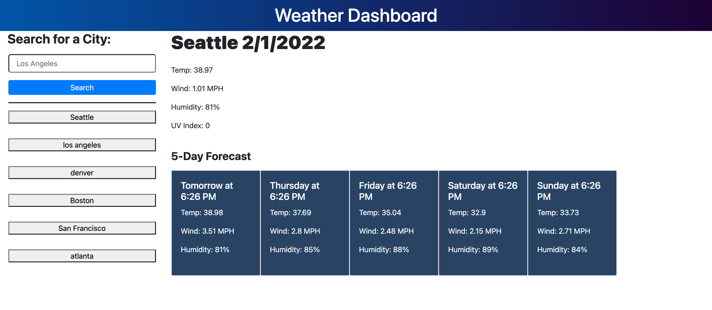

# Weather Dashboard

## Purpose
---
The main purpose and goal of this web application is to show the current weather of whatever city the user inputs. In addition, it will show a 5-Day Forecast of the weather in that specified city.  
Also, whatever city the user searches for will be saved on the left and the user will be able to click on the city to see the weather information again.

## Skills Used:
---
The main skills used were HTML, CSS, and JavaScript.

## API Links Used:
---
- https://openweathermap.org/current
- https://openweathermap.org/api/one-call-api
- https://openweathermap.org/forecast5

## Screenshot of Web Application:
---

## Live Links:
---
- GitHub:
    - https://github.com/calvin-kim13/weatherForecast
- Live Web App:
    - hi

